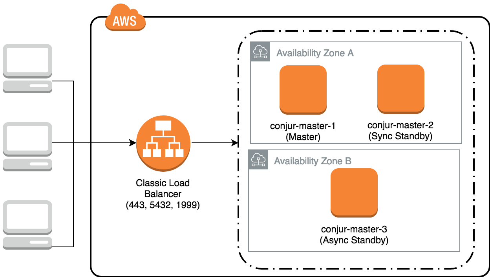

# Conjur HA in AWS

## Introduction
This project demonstrates deploying and managing a HA Conjur cluster in AWS.
The architecture for this deployment is as follows:



### Load Balancer

This demo uses an AWS Classic Load Balancer (LB) as the ingress point for
connections to the master cluster. The LB is responsible for performing
health checks against the three nodes to determine which one is active
and should receive traffic.

The LB forwards three TCP ports to the active master cluster node:

- 443: HTTPS traffic for API and UI interactions
- 5432: Follower data replication from the Master
- 1999: Follower audit log forward to the Master

The LB considers a health node one that returns a `200-339` status code
from its `/health` endpoint.

### EC2 Master Instances

The master cluster nodes are all EC2 instances running the Conjur EE
AMI image. This demo uses `m4.large` instance types and the security groups
allow inbound connects on ports:

- 443: HTTPS traffic
- 5432: Postgres traffic for follower replication
- 1999: Syslog traffic for follower audit log forwarding
- 22: SSH traffic for system administration

## Prerequisites

This demo requires the following tools to:

- Docker
- Docker Compose
- Terraform
- AWS CLI

## Deployment

To initially install the cluster:

1. Create a file in the project directory called `terraform.tfvars` and
   configure the AWS environment for the deployment:
    ```sh
    # (OPTIONAL) Arbitrary prefix to add to each resource name
    resource_prefix = ""

    # (REQUIRED) VPC to provision Load Balancer and Nodes into
    vpc_id = ""

    # (REQUIRED) AMI to use for Conjur Master nodes
    ami_id = ""

    # (REQUIRED) Name of SSH key pair to attach to Conjur Master nodes
    key_name = ""

    # (OPTIONAL) Names of availability zones to use for nodes, 
    # defaults to the value below
    availability_zones = ["us-east-1a", "us-east-1b"]
    ```

2. Provision the AWS resources
    > The terraform scripts assumes you will set the AWS connection credentials as
    > environment variables.
    ```sh-session
    $ ./0_terraform_aws
    ...
    ```

2. Generate certificates for the Cluster
    > TBD, for now the cluster will use self-generated certificates

3. Initialize the Conjur Cluster
    ```sh-session
    $ ./1_init_cluster
    ...
    ```

4. Deploy a Follower in AWS
    > TBD


## HA Scenarios

This demo environment allows to walk through 3 HA management scenarios with Conjur

### Auto-Failover

1. Kill the Master Node
    > TBD

2. Observe Autofailover status
    > TBD

### Failed Node Re-Enrollment

1. Clean State on Failed Instance
    > TBD

2. Re-create Conjur Appliance on Instance
    > TBD

3. Provision the New Appliance as a Standby
    > TBD

4. Re-Enroll the Standby into the Cluster
    > TBD

### Reboot Entire Cluster

1. Stop All Instances
    > TBD

2. Start Active Master
    > TBD

3. Start Standbys
    > TBD

## Cleanup

1. Clean up the AWS resources
    ```sh-session
    $ ./100_cleanup_aws
    ...
    ```